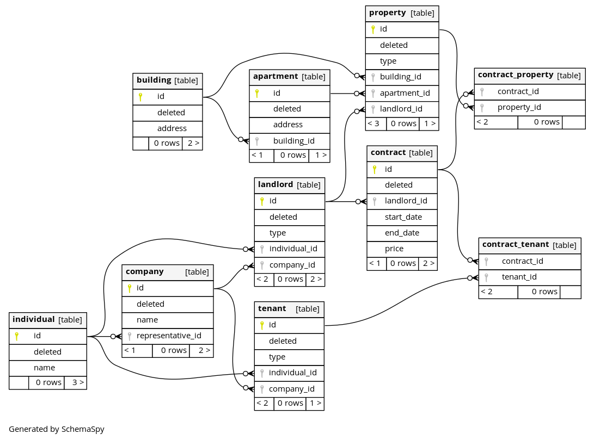
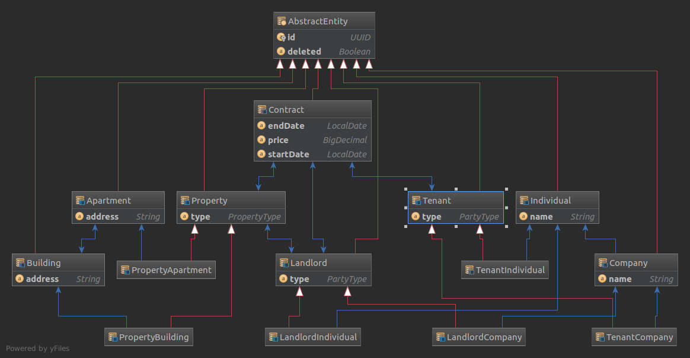

# Demo rent domain diagram 

## Task description

Please create the domain model for the following use cases: 
1) A landlord can rent out a separate apartment, the whole building or several apartments to another party. 
2) A landlord can sign a rental contract with one or multiple tenants. 
3) One tenant can rent multiple apartments from the same landlord. 
4) One tenant can rent multiple apartments simultaneously. 
5) A landlord can also be a tenant of another landlord. 
We suggest ER diagram as an outcome of this task but you can choose a format that makes more sense for you.

## Assumptions 

- Entities are deleted only logically - they are marked as deleted to keep consistency.
- When landlord signs contract with multiple tenants the contract object/objects. 
  (apartment, several apartments, building) is/are assumed to be rented by all tenants as a group.
- Tenants and landlords might be either individuals or companies.
- PostgreSQL is used as a relational database.
- No detailed domain analysis was done for getting useful entity attributes, etc. 

## Implementation

- Database ddl script is developed. See [rentdb.sql](src/main/resources/rentdb.sql). 
- Entities are developed for the domain and mapped to database tables.
- ER diagrams are generated from database (via [schemaspy](http://schemaspy.org)) 
and from entity classes (via [Intellij Idea](https://www.jetbrains.com/idea))

### SchemaSpy generated ER diagram

### Intellij Idea generated ER diagram

### Build database documentation with schemaspy

`mkdir -p schema && rm -rf schema/* && docker-compose down && docker-compose up`

To view database details open **schema/index.html** in your browser.

To view the entity relations diagram open **schema/diagrams/summary/relationships.real.large.png**.

## TODO

- Use postgresql enumerated types for contract_object type and tenant type.
- Add comments for tables & fields.
- Decide if timezones support is necessary.
- Use embedded database instead of docker for testing and generating documentation.
- Use database migration tool such as flywaydb or liquibase.
- Control constraint that landlord of the contract is the same landlord of the contract property.
- Create indexes if necessary (foreign keys, columns for queries).
- Think about entities lifecycle use cases (change of landlord via purchase, disappear via fire, etc) 
and adopt domain model.